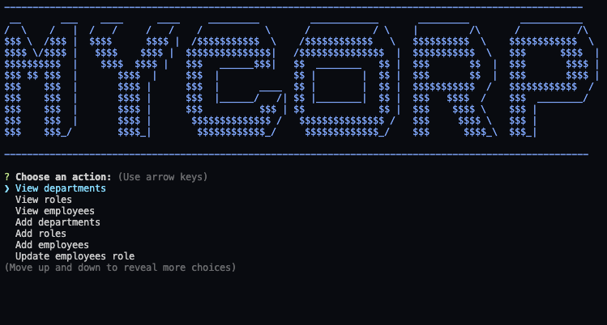

# Noted

# Description
This is a command line application that is designed for a Management company.This is program is a CMS(content management system) that is designed to allow a manager to view, add, and edit their company's employees, departments, and roles. This command line application incorporates the use of a database to store the company's information.  [Deployed Webpage](https://obscure-inlet-06343.herokuapp.com/)

# Table of Contents
1. [Description](#Description)
2. [Installation](#Installation)
3. [Usage](#Usage)
4. [licence](#License)
5. [Technologies](#Technologies)
6. [Included Features](#Included-Features)
6. [Future Improvements](#Future-Improvements)

## Finished-Page

# Installation
Go to this https://github.com/devontehillman/MyCorp and the clone repository. To run this application on your local machine, open integrated terminal at the MyCorp file type 'npm install' to install the included modules. If you want to use the seed file you can copy paste it into the mysql work bench and execute it. Another option is to upload the sql file through the terminal by running 'mysql -u root -p'. Enter your password for mysql. Then, in the terminal run 'source employee.sql'. Check inside the mysql work bench to see if the database was created. Now, before running the server file you have to establish a connection to the database. Create a .gitignore file and in it type config (this is so that your password is not exposed if you choose to do a git push).Now in the config folder in the local.js file enter your mysql password into the password property and save.

# Usage
 In the terminal type 'node server'. This should start the program and prompt you for the action you want to execute. Scroll through the dropdown menu and press enter on the action you want to execute.

# license
To see information on the no license click the badge at the top of this README.

# Technologies
* Nodejs
    * mysql
    * console table 
    * inquirer
* SQL
    * MySQL Workbench

# Included-Features
  * View departments, roles, employees
  
  * Add departments, roles, employees

  * Update employee roles by employee ID

# Future-Improvements
Adding these additional functionalities: 
* Update employee managers

* View employees by manager

* Delete departments, roles, and employees

* View the total utilized budget of a department -- ie the combined salaries of all employees in that department

* Integration into a website for a better UX.

